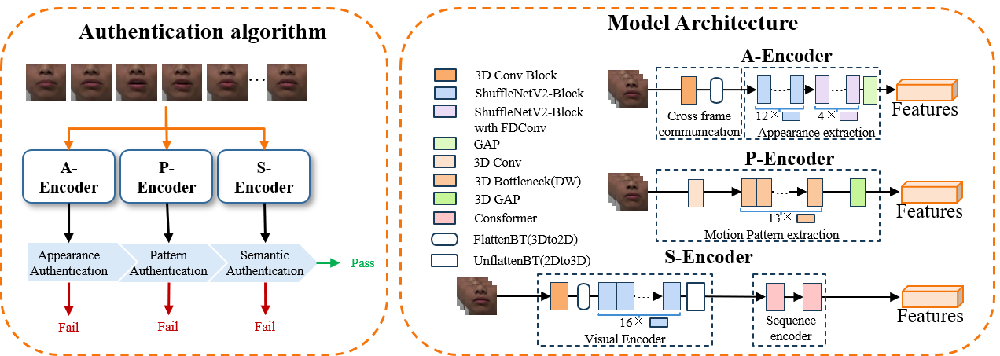

# VSALip

Visual Speaker Authentication via Lip Motions: Appearance Consistency and Semantic Disentanglement

Need to update...

## Content
[VSALip Project](#VSALip-Project)
- [Introduction](#introduction)
- [How to install the environment](#How-to-prepare-the-dataset)
- [How to prepare the dataset](#how-to-prepare-dataset)
- [How to train](#how-to-train)
- [How to test](#how-to-test)

[Citation](#citation)

[License](#license)


## VSALip Project
### Introduction
Lip-based visual biometric technology shows significant potential for improving the security of identity authentication in human-computer interaction. However, variations in lip contours and the entanglement of dynamic and semantic features limit its performance. To tackle these challenges, we revisit the personalized characteristics in lip-motion signals and propose a lip-based authentication framework based on personalized feature modeling. Specifically, the framework adopts a “shallow 3D CNN + deep 2D CNN” architecture to extract dynamic lip appearance features during speech, and introduces an appearance consistency loss to capture spatially invariant features across frames. For dynamic features, a semantic decoupling strategy is proposed to force the model to learn lip motion patterns that are independent of semantic content. Additionally, we design a dynamic password authentication method based on visual speech recognition (VSR) to enhance system security. In our approach, appearance and motion patterns are used for speaker verification, while VSR results are used for passphrase verification — they working jointly. Experiments on the ICSLR and GRID datasets show that our method achieves excellent performance in terms of authentication accuracy and robustness, highlighting its potential in secure human-computer interaction scenarios. 



### How to install the environment

This guide explains how to set up the environment for the VSALip project, including Python environment, PyTorch framework, required libraries, and face detection/alignment models. Follow the steps sequentially.

1. **Download the project**  
   The project has not been uploaded to GitHub. Please contact the author to obtain `VSALip.tar.gz (414.40 MB)`.

2. **Create and activate Conda environment**
```bash
conda create -y -n VSALip python=3.9
conda activate VSALip
````

3. **Install PyTorch**
   CPU version:

```bash
pip install torch==2.0.1 torchvision==0.15.2 torchaudio==2.0.2 --index-url https://download.pytorch.org/whl/cpu
```

GPU version (CUDA 11.7):

```bash
conda install pytorch==2.0.1 torchvision==0.15.2 torchaudio==2.0.2 pytorch-cuda=11.7 -c pytorch -c nvidia
```

4. **Install required libraries**

```bash
pip install sentencepiece av six opencv-python scikit-image tqdm thop tensorboard pyyaml tiktoken chardet
pip install einops tensorboardX
```

> Note: The latest version of pip may conflict with fairseq. If installation fails, downgrade pip:

```bash
python -m pip install pip==24.0
```

5. **Install MMCV**

```bash
python -m pip install openmim
python -m mim install mmcv-full
```

6. **Install preprocessing models (optional, not required for training/evaluation)**
   Face detection:

```bash
git clone https://github.com/hhj1897/face_detection.git
cd face_detection
git lfs pull  # optional
pip install -e .
```

Face alignment:

```bash
git clone https://github.com/hhj1897/face_detection.git
cd face_detection
git lfs pull  # optional
pip install -e .
```

After completing these steps, the VSALip environment is ready for data preprocessing, training, and evaluation.


### How to prepare the dataset

Our project refers to VSR; for dataset preprocessing, please see [auto_avsr](https://github.com/mpc001/auto_avsr).


### How to train

Need to update...
```Shell
usage: ldw_main.py [-h] [--model MODEL] [--data DATA] [--root_dir ROOT_DIR]
                   [--modality MODALITY] [--weights WEIGHTS]
                   [--aux_weights AUX_WEIGHTS] [--model_name MODEL_NAME]
                   [--run_exp_dir RUN_EXP_DIR] [--max_epochs MAX_EPOCHS]
                   [--batch BATCH] [--save_every_epoch SAVE_EVERY_EPOCH]
                   [--save_dir SAVE_DIR] [--device DEVICE]
                   [--pretrained PRETRAINED] [--freeze FREEZE]
                   [--optimizer OPTIMIZER] [--lr LR]
                   [--warmup_epochs WARMUP_EPOCHS]
                   [--weight_decay WEIGHT_DECAY] [--resume RESUME]
                   [--workers WORKERS] [--save_per_sample SAVE_PER_SAMPLE]
                   [--half HALF] [--ctc_weight CTC_WEIGHT]
                   [--beam_size BEAM_SIZE] [--lm_weight LM_WEIGHT]
                   [--test_data TEST_DATA]
                   [--lipauthEval_data LIPAUTHEVAL_DATA] [--ids_user IDS_USER]
                   [--save_featuresPath SAVE_FEATURESPATH]
                   [--attack_type ATTACK_TYPE] [--attack_level ATTACK_LEVEL]
                   [--source SOURCE] [--layer_depth LAYER_DEPTH]
                   [--export_name EXPORT_NAME] [--export_layers EXPORT_LAYERS]
                   [--reWeights_name REWEIGHTS_NAME] [--results RESULTS]
                   task mode
```

### How to test

You need to process the data first before conducting an evaluation.

1. User personalized feature registration (A-Encoder+P-Encoder).
The registration of VSA requires you to select the lipauth task, register mode, and then specify the dataset, model, weights and ids_user, for example:
```Shell
python main.py lipauth register \
               data=icslrAuth.yaml \
               model=icslr/A_Encoder_icslr.yaml \
               root_dir=ROOTDIR \
               weights=run_exp/A_Encoder_icslr/model.pth ^
               ids_user=[3,5,19,20]
```

2. Evaluate the VSA performance.
The evaluation of VSA requires you to select the lipauth task, eval mode, and then specify the dataset, model, and test sample pairs, for example:
```Shell
python main.py lipauth eval  \
               data=icslrAuth.yaml  \
               model=Pro_001_Displays/icslr/A_Encoder_icslr.yaml  \
               root_dir=ROOTDIR  \
               lipauthEval_data=labels/icslrAuth/icslrAuth_Celeb1_test_20000.ref
```


## Performance

If you find this code useful in your research, please consider to cite the following papers:

### Lip-based Authentication(ICSLR/GRID)

The recognition performance of different feature models on ICSLR is as follows：

| Encoder     | EER/% |  TPR@FAR=1% |  TPR@FAR=0.1% |
| ------------ | -------------- | ---------------- | ----------- |
| A-Encoder | 0.79           | 99.25         | 95.99    |
| P-Encoder       | 0.85           | 99.37         | 97.35    |


## Citation

If you find this code useful in your research, please consider to cite the following papers:

```bibtex
need to update...
```


## License

It is noted that the code can only be used for comparative or benchmarking purposes. Users can only use code supplied under a [License](./LICENSE) for non-commercial purposes.

